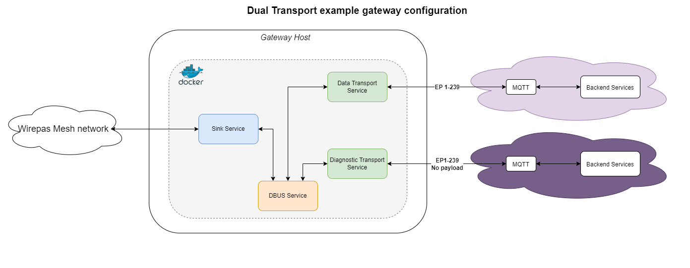

# Dual Transport example

The goal of this example is to setup a gateway which has a single sink and two transport services. 

This configuration covers the use case whereby you would wish to fork its application payload to a dedicated backend for processing whilst still routing the diagnostic packets to a Wirepas backend. 

The gateway has the following functionality: 
- Route data application endpoint range to a broker
- Route the diagnostic endpoints to another broker (i.e. a WNT backend broker)

The below figure presents the gateway configuration covered in this example:



## Customize the template file

[The template file](docker-compose.yml) requires some configuration to fit your environement.

### Data transport service

The environment part contains multiples variable to customize. Typically, the packets' endpoints that are reserved by Wirepas are in the range 240 to 255. Thus, an option can be added to instruct the data transport service to not publish these packets to the specified MQTT broker.  

Example:

```yml
environment:
  WM_GW_ID: "my_gateway_01"
  WM_GW_MODEL: "gw_hardware_xx"
  WM_GW_VERSION: "docker_based_gw"
  WM_GW_IGNORED_ENDPOINTS_FILTER: "[240-255]"
  WM_SERVICES_MQTT_HOSTNAME: "my_server.com"
  WM_SERVICES_MQTT_PORT: "8883"
  WM_SERVICES_MQTT_USERNAME: "username"
  WM_SERVICES_MQTT_PASSWORD: "password"
```

### Diagnostic transport service

The environment part contains multiples variable to customize. Whilst it would be possible to ignore the endpoint range 1 to 239, the data packets from the application are indeed used by WNT (i.e. to estimate travel time in the network). However, the diagnostic part is not concerned with the payload (which is customer specific). Thus, an option can be added to strip the application packets from their payload prior to being published to the specified MQTT broker.

Example:

```yml
environment:
  WM_GW_ID: "my_gateway_01"
  WM_GW_MODEL: "gw_hardware_xx"
  WM_GW_VERSION: "docker_based_gw"
  WM_GW_WHITENED_ENDPOINTS_FILTER: "[1-239]"
  WM_SERVICES_MQTT_HOSTNAME: "my_server.com"
  WM_SERVICES_MQTT_PORT: "8883"
  WM_SERVICES_MQTT_USERNAME: "username"
  WM_SERVICES_MQTT_PASSWORD: "password"
```

### Sink service

There are two things to modify in the sink-service container.

First you must specify the device to control (on which port your sink is attached in your host):

Example if your sink is on /dev/ttyACM0:

```yml
devices:
  - /dev/ttyACM0:/dev/mysink      
```

And environment must be customized too:

```yml
environment:
  # If the baudrate is not specified, auto baudrate is used: ie testing successively 125000bps, 115200bps, 1000000bps
  WM_GW_SINK_BAUDRATE: "125000"
  WM_GW_SINK_ID: "1"
```

