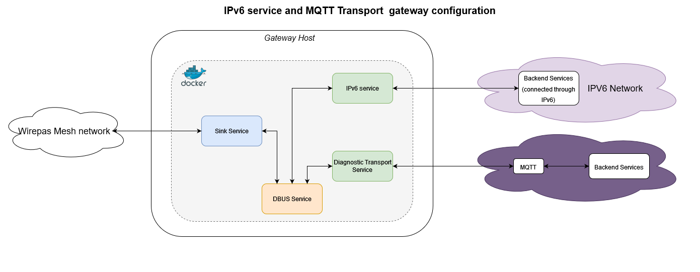

# Gateway with MQTT transport and ipv6 service

The goal of this example is to setup a gateway which support our standard MQTT protocol and the ipv6 service.

The below figure presents the gateway configuration covered in this example:



## Customize the template file

[The template file](docker-compose.yml) requires some configuration to fit your environment.

### Transport service and sink service configuration

How to customize this part can be found in [single transport example](../single_transport/README.md).

### IPv6 service

As an example, let's assume that the ipv6 subnet for your network is fc00:1234::/64 and that your backend as the following address inside this network fc00:1234::1

If your gateway is connected through ethernet (eth0) configuration could be like this

```yml
 environment:
      # Off mesh IPV6 address (optional)
      WM_IPV6_OFF_MESH_SERVICE: "fc00:1234::1"
      # Which interface to use from the host
      WM_IPV6_EXTERNAL_INTERFACE: "eth0"
```

The off mesh service can be on a different subnet but routing must be in place to route traffic from one subnet to the other.


