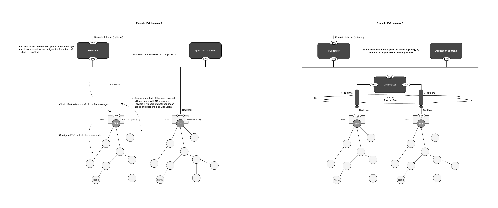

# Wirepas Gateway IPv6 Service (border router)

## Overview
This service allows Wirepas gateway to act as an IPv6 border router.
As other services, it connects with dbus to interact with the Wirepas network through sink services.

This service does the translation between ipv6 addresses to Wirepas addresses.
It must be connected to an IPv6 network.

## IPv6 configuration

### Topology

Each gateway must belong to a 64 bits ipv6 sub-network.

All gateways from the same network can belongs to the same IPv6 subnet or different ones.
The gateway sharing the same 64 bits prefix (same subnet) must be on the same link.

Gateways will be on-link if they are connected to the same ethernet connection for example, but they can also be connected logically to the same link through a layer 2 Virtual Private Network.

Two IPv6 configuration are depicted in following diagram with and without a VPN:




### Prefix advertisement

The 64 bits IPv6 prefix required by the gateways must be advertised from an IPv6 router on the link.

[This section](#setup-a-fisrt-demo) gives an example to achieve it on a local network.

## How to configure your gateway

The IPv6 service needs two parameters to be started.

| Parameter | Purpose | Note |
| ------------- | ----    | ---  |
| External interface | This is the network interface to which the 64 bits prefix is advertised |  |
| Off mesh address  | Off mesh address is an IPv6 address that is received by all the nodes. This address can be the one of the application backend from previous diagram. This address will be accessible to the nodes at run time. | it must be ensured that this address is either on link or routable from the gateway. Configuration of the routing table of the gateway are out of scope for this document |

IPv6 service is available as a docker images to ease the integration.

[This folder](../docker/docker-compose/ipv6_and_mqtt_transport/) gives you an example to create a compatible ipv6 gateway.


## Setup a first local demo

This demo will contain:
- One machine for the main IPv6 router
- A Wirepas gateway (raspberry pi for example)
- One machine to act as the backend server.

The 3 machines must be connected to the same Ethernet network as depicted on following diagram:


### Create a Wirepas network

First of all you must create a network with IPv6 compatible nodes. You can use the [ipv6_icmpv6_nodes](https://github.com/wirepas/wm-sdk/tree/ipv6_beta1/source/example_apps/ipv6_icmpv6_nodes) application available in Wirepas SDK as a starting point.

### Select an ipv6 prefix

Select any prefix from private range. For example fc00:1234::/64

### Create an ipv6 router

The main role for this router is to broadcast the ipv6 prefix on the link.
In this demo we use a private range, but if this router was delegated a public IPv6 range it could be used instead and it could work as the default IPv6 gateway for the network (but it is out of scope of this demo).

One option is to use a Linux system with systemd-networkd (tested with Systemd version 241).

In following example this machien is connected to the IPv6 link with interface eth0.

Create a file named /etc/systemd/network/wirepas.network with the following content:

```yml
[Match]
Name=eth0

[Network]
IPv6SendRA=yes

[IPv6Prefix]
Prefix=fc00:1234::/64
Assign=true
```

Restart the systemd-networkd service:


```
sudo systemctl restart systemd-networkd
```

### Get backend server address

Connect the third machine to the same network.
This machine should obtain an IPv6 address inside the 64 bits prefix advertised by the IPv6 router.
You can find it with "ipconfig" cmd on Windows or "ip a" on Linux.

*fc00:1234::bbbb:bbbb in our previous diagram.*

### Configure the gateway

Create your gateway as explained [above](#how-to-configure-your-gateway) with following modification in the docker-compose:

```yml
 environment:
      # Off mesh IPV6 address from your backend
      WM_IPV6_OFF_MESH_SERVICE: "fc00:1234::bbbb:bbbb"
      # Which interface to use from the host
      WM_IPV6_EXTERNAL_INTERFACE: "eth0"
```

### Test that it works

If you connect Wireshark on your backend machine, you should see traffic coming from your Wirepas nodes from UDP port 20 to 30. It contains an incremental counter sent every 10s.

You can also ping the nodes thanks to the address you will see from Wireshark or by creating them yourself with the following pattern <Ipv6 64 bits prefix>:<Wirepas sink address on 32 bits>:<Wirepas node address on 32 bits>

As an example, in previous demo, if your node has address 2 and your sink attached to your gateway has address 1, your node IPv6 address will be fc00:1234:0000:0000:0000:0001:0000:0002 (or fc00:1234::1:0:2 as a shorten version)

If you have used [ipv6_icmpv6_nodes](https://github.com/wirepas/wm-sdk/tree/ipv6_beta1/source/example_apps/ipv6_icmpv6_nodes) unmodified and if you follow [this Wireshark guide](https://github.com/wirepas/wm-sdk/tree/ipv6_beta1/util/wireshark) you should be able to also see the traffic from any of your nodes by connecting to them through UART.
